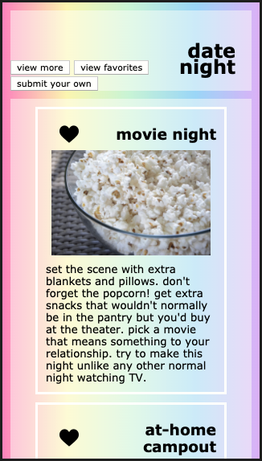
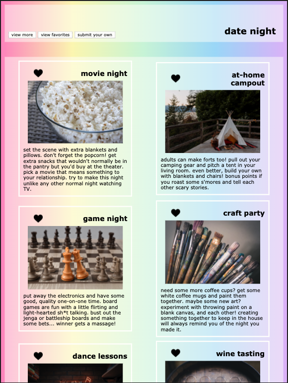
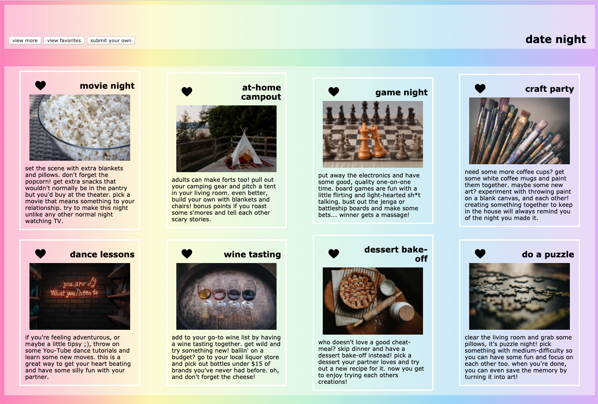

### Mod 1 Static Comp Challenge 1

#### Overview

This is the first static comp challenge in Mod 1 at Turing. We are to build a static webpage using only HTML and CSS. We have been given a layout that we must stick to but our creative license includes images, icons, color palette and content. Our site must be responsive, include a normalize or reset file in CSS and work on Firefox, Safari and Chrome. I have chosen to create a website that gives users ideas of at-home date night themes.

#### Original static comp

This is the example of the original static comp displaying the layout we must stick to.

#### My static Comp

Below are the layouts on different screen sizes.

###### Mobile view

###### Tablet view

###### Large-screen view

GitHub: https://github.com/ErinUntermeyer
